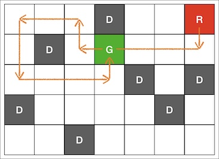

## 문제 설명

리코쳇 로봇이라는 보드게임이 있습니다.

이 보드게임은 격자모양 게임판 위에서 말을 움직이는 게임으로, 시작 위치에서 출발한 뒤 목표 위치에 정확하게 멈추기 위해 최소 몇 번의 이동이 필요한지 말하는 게임입니다.

이 게임에서 말의 이동은 현재 위치에서 상, 하, 좌, 우 중 한 방향으로 게임판 위의 장애물이나 게임판 가장자리까지 부딪힐 때까지 미끄러져 움직이는 것을 한 번의 이동으로 정의합니다.

다음은 보드게임판을 나타낸 예시입니다. ("."은 빈 공간을, "R"은 로봇의 처음 위치를, "D"는 장애물의 위치를, "G"는 목표지점을 나타냅니다.)

```
...D..R
.D.G...
....D.D
D....D.
..D....
```

이때 최소 움직임은 7번이며 "R" 위치에서 아래, 왼쪽, 위, 왼쪽, 아래, 오른쪽, 위 순서로 움직이면 "G" 위치에 멈춰 설 수 있습니다.

리코챗로봇.jpg

게임판의 상태를 나타내는 문자열 배열 board가 주어졌을 때, 말이 목표위치에 도달하는데 최소 몇 번 이동해야 하는지 return 하는 solution함수를 완성해주세요. 만약 목표위치에 도달할 수 없다면 -1을 return 해주세요.

## 제한 사항

- 3 ≤ board의 길이 ≤ 100
  - 3 ≤ board의 원소의 길이 ≤ 100
  - board의 원소의 길이는 모두 동일합니다.
  - 문자열은 ".", "D", "R", "G"로만 구성되어 있으며 각각 빈 공간, 장애물, 로봇의 처음 위치, 목표 지점을 나타냅니다.
  - "R"과 "G"는 한 번씩 등장합니다.

## 입출력 예

| board                                                   | result |
|---------------------------------------------------------|--------|
| ["...D..R", ".D.G...", "....D.D", "D....D.", "..D...."] | 7      |
| [".D.R", "....", ".G..", "...D"]                        | -1     |

## 입출력 예 설명

입출력 예 #1

문제 설명의 예시와 같습니다.

입출력 예 #2

```
.D.R
....
.G..
...D
```

- "R" 위치에 있는 말을 어떻게 움직여도 "G" 에 도달시킬 수 없습니다.
- 따라서 -1을 return 합니다.
